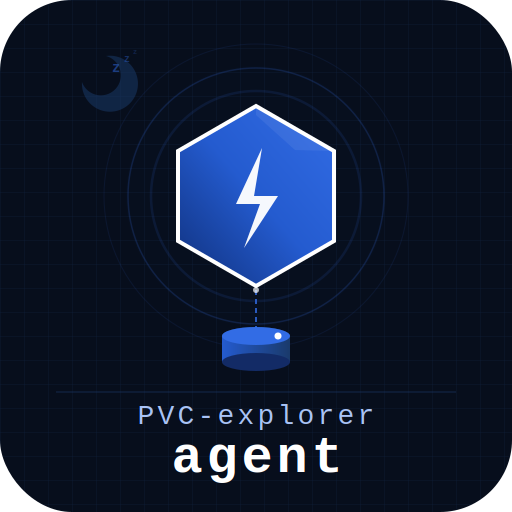

<p align="center">
	<picture>
		<source media="(prefers-color-scheme: dark)" srcset="docs/branding/logo.svg">
		<source media="(prefers-color-scheme: light)" srcset="docs/branding/logo-light.svg">
		
	</picture>
</p>

<p align="center">
	<a href="LICENSE"></a>
	<a href="https://go.dev"></a>
</p>

<p align="center">
	pvc-explorer-agent is a lightweight HTTP file-browser agent that mounts a PersistentVolumeClaim and exposes its contents over a simple REST API.
</p>

> [!NOTE]
> By default the agent has no authentication and is only reachable through the
> controller proxy, which enforces Basic Auth and role checks. Never expose the
> agent port directly.
>
> Optional Bearer token authentication can be enabled by setting the `AUTH_TOKEN`
> environment variable. When set, every request must include an
> `Authorization: Bearer <token>` header.

## Community

- [Contributing guide](CONTRIBUTING.md)
- [Code of Conduct](CODE_OF_CONDUCT.md)
- [Security policy](SECURITY.md)

## Highlights

- HTTP file browser endpoints for listing, downloading, editing, and uploading files
- Read-only fallback when another workload is using the same PVC
- An embedded Vue UI for standalone use

## 🚀 Getting Started

Start with the overview in [docs/getting-started.md](docs/getting-started.md).

For the runtime model and API surface, see [docs/overview.md](docs/overview.md).

For local development and test commands, see [docs/development.md](docs/development.md).

For CRA, open source security, and license compliance notes, see [docs/CRA_COMPLIANCE.md](docs/CRA_COMPLIANCE.md), [docs/OPEN_SOURCE_SECURITY.md](docs/OPEN_SOURCE_SECURITY.md), and [docs/LICENSE_COMPLIANCE.md](docs/LICENSE_COMPLIANCE.md).

### Quick start

```bash
go run ./cmd/agent -root /tmp/testdata -pvc my-pvc
```

## Container Images

- Stable OCI images are published to `ghcr.io/pvc-explorer-operator/pvc-explorer-agent` from GitHub releases.
- The latest stable release is also published as `:latest`.
- A mutable development image is published as `:dev` from `main` when changes affect the published image.
- Published images are multi-arch OCI indexes for `linux/amd64` and `linux/arm64`.
- If you need a branch-specific or experimental image, build your own locally from `Dockerfile`.
- `Dockerfile.acme` is kept as a documented overlay example only. ACME images are not built or published by this project.

### Pull images

```bash
docker pull ghcr.io/pvc-explorer-operator/pvc-explorer-agent:latest
docker pull ghcr.io/pvc-explorer-operator/pvc-explorer-agent:dev
docker pull ghcr.io/pvc-explorer-operator/pvc-explorer-agent:v0.1.0
```

### Verify signatures

Published images are signed keylessly with cosign and GitHub Actions OIDC.

```bash
cosign verify ghcr.io/pvc-explorer-operator/pvc-explorer-agent:latest \
  --certificate-identity-regexp 'https://github.com/pvc-explorer-operator/pvc-explorer-agent/.github/workflows/oci-image.yml@.*' \
  --certificate-oidc-issuer https://token.actions.githubusercontent.com
```

Build provenance is published alongside the image manifest as an OCI attestation.

```bash
cosign verify-attestation ghcr.io/pvc-explorer-operator/pvc-explorer-agent:latest \
  --type slsaprovenance \
  --certificate-identity-regexp 'https://github.com/pvc-explorer-operator/pvc-explorer-agent/.github/workflows/oci-image.yml@.*' \
  --certificate-oidc-issuer https://token.actions.githubusercontent.com
```

An SBOM attestation is also published alongside the image.

```bash
cosign verify-attestation ghcr.io/pvc-explorer-operator/pvc-explorer-agent:latest \
  --type spdxjson \
  --certificate-identity-regexp 'https://github.com/pvc-explorer-operator/pvc-explorer-agent/.github/workflows/oci-image.yml@.*' \
  --certificate-oidc-issuer https://token.actions.githubusercontent.com
```

Downloadable SBOM files are also published. The Syft-generated SPDX JSON SBOM is
attached to the image as an OCI artifact via `cosign attach sbom`:

```bash
# Download the SBOM for the latest release
cosign download sbom ghcr.io/pvc-explorer-operator/pvc-explorer-agent:latest

# Download the SBOM for the dev image
cosign download sbom ghcr.io/pvc-explorer-operator/pvc-explorer-agent:dev

# Download the SBOM for a specific release
cosign download sbom ghcr.io/pvc-explorer-operator/pvc-explorer-agent:v0.1.0
```

Additionally:

- For stable releases: the same `sbom-<tag>.spdx.json` file is also attached as a
  release asset on the GitHub Release page for direct download.

### Release process

1. Merge the release-ready changes into `main`.
2. Create and push a version tag such as `v0.1.0`.
3. Draft or publish a GitHub Release for that tag.
4. Publishing the release triggers the image workflow.
5. The workflow builds from `Dockerfile`, pushes `ghcr.io/pvc-explorer-operator/pvc-explorer-agent:v0.1.0`, signs it with cosign, and attaches provenance.
6. If the release is not marked as a prerelease, the same digest is also tagged as `:latest`.

Pushes to `main` that change published-image inputs refresh the mutable `:dev` image.

For a GitHub release reference and platform mapping, see [docs/release-reference.md](docs/release-reference.md).

For maintainers, see [RELEASE.md](RELEASE.md) for a copy-paste release checklist.

## 📚 Documentation

- Contributor workflow: [CONTRIBUTING.md](CONTRIBUTING.md)
- Development workflow: [docs/development.md](docs/development.md)
- Local usage and startup: [docs/getting-started.md](docs/getting-started.md)
- Overview and API surface: [docs/overview.md](docs/overview.md)
- Release reference: [docs/release-reference.md](docs/release-reference.md)
- Maintainer release playbook: [RELEASE.md](RELEASE.md)
- Security reporting: [SECURITY.md](SECURITY.md)
- UI overlays: [docs/overlays.md](docs/overlays.md)
- CRA compliance: [docs/CRA_COMPLIANCE.md](docs/CRA_COMPLIANCE.md)
- Open source security: [docs/OPEN_SOURCE_SECURITY.md](docs/OPEN_SOURCE_SECURITY.md)
- License compliance: [docs/LICENSE_COMPLIANCE.md](docs/LICENSE_COMPLIANCE.md)

### Local quality and compliance commands

```bash
make check
make vuln-check
make sbom
make license-check
```

## 🤝 Contributing

Contributions are welcome. Start with [CONTRIBUTING.md](CONTRIBUTING.md) and pick up an issue labelled `good first issue` when you want a small, well-scoped task.

## 👨‍💻 Maintainers

This project is maintained in public. If you need help, open an issue or start a discussion in the repository.

## 📝 License

Apache License 2.0. See [LICENSE](LICENSE).

